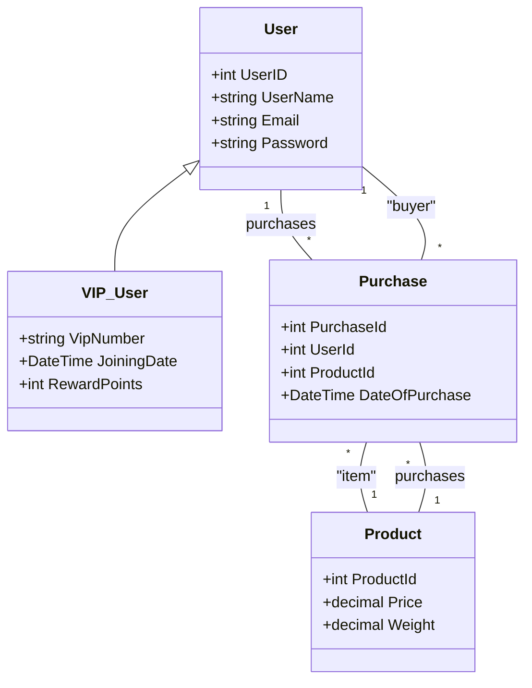

```mermaid
classDiagram
	class User {
		+int UserID
		+string UserName
		+string Email
		+string Password
	}

	class VIP_User {
		+string VipNumber
		+DateTime JoiningDate
		+int RewardPoints
	}

	class Product {
		+int ProductId
		+decimal Price
		+decimal Weight
	}

	class Purchase {
		+int PurchaseId
		+int UserId
		+int ProductId
		+DateTime DateOfPurchase
	}

	%% Inheritance
	User <|-- VIP_User

	%% Associations
	User "1" -- "*" Purchase : purchases
	Product "1" -- "*" Purchase : purchases
	Purchase "*" -- "1" User : "buyer"
	Purchase "*" -- "1" Product : "item"
```

This diagram represents the classes in `ShopAPI/Models` and their relationships: `VIP_User` inherits from `User`; `Purchase` links `User` and `Product`.
